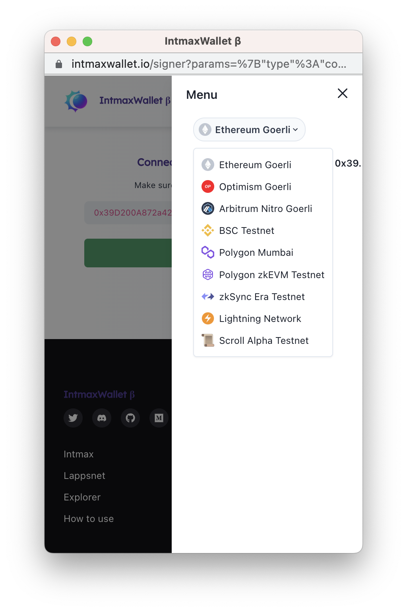

# Getting Started Intmaxjs

> Note:
> Currently works best with google chrome.

## `npm start`

Runs the app in the development mode.\
Open [http://localhost:3000](http://localhost:3000) to view it in the browser.

## Learn More

You can follow tutorial from [Intmax](https://www.youtube.com/watch?v=L5n9EPQ378Q&t=255s).
